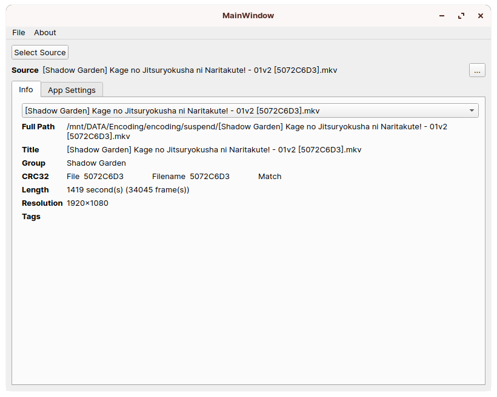
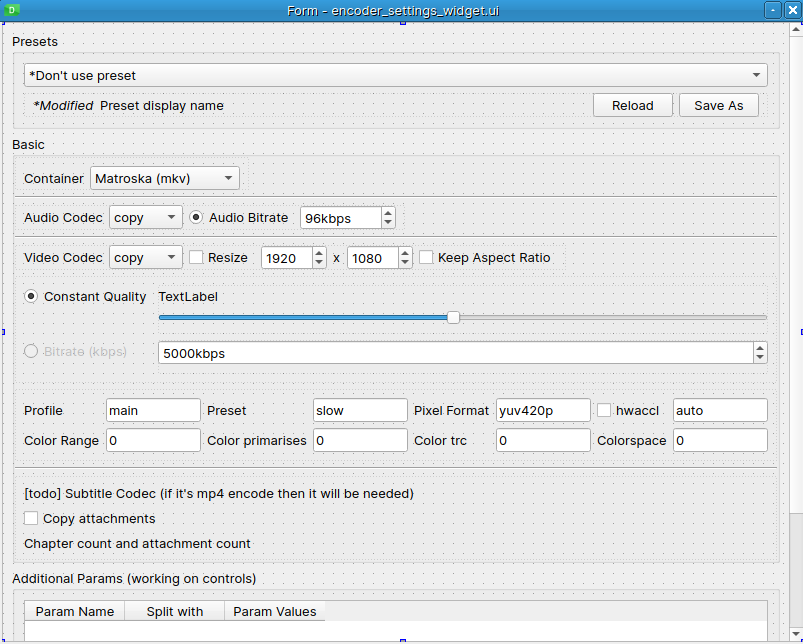

# Anime encoder based on SmallSizedAnimation's encode recipe

## First, I want to apologize

 As someone who has little experience coding, I want to apologize for all bugs and improper coding styles in my code. I will do my best to correct those mistakes.

## How it came into being

 I watch (a lot of) anime :) and if possibe, I want to archive them. In the search of group that do small animation encode, I found Small Sized Animations (SSA). It has small file size and relativly decent quality.

 In late 2021, SSA closed the server ([read here](https://ny.iss.one/view/1445824#com-1)) and shared the encode setting used to encode anime. It was available at the website but as of this writing (March 7, 2023), the server is down. The good news is that [someone](https://ny.iss.one/view/1445824#com-17) had archived the website so I am able to read it [here](https://pastebin.com/JmWGsEng). SSA commisioned his/her friend to make a program (which I wasn't able to find anywhere). Then, I thought of making my own script. I put it into action, so here I am.

## and then

 I tried HandBrake, but the quality wasn't good compaired to ffmpeg. Either HandBrake isn't as good as ffmpeg in terms of encode quality under the same settings or it is me the stupid one who didn't setup HandBrake properly. Anyway, I proceed to the making of a command line script.

 After I made the script (the `main.py` file, with which I have encoded many episodes), the thought of "why do I go through all the troubles making a program instead of finding another encode group (like Hi10, Judas, AkihitoSubs and many more)" sliped into my mind.

 (I got discouraged... kinda wanna giveup)

## The main topic, about this repository

 I use this repository to backup my code in case my storage died. Until I sort out my files it is going to be messy.

 As stated above, this script is designed to encode anime using SSA's encode settings and therefore it is not a general purpose anime encoder.

 Feel free to use it if it useful (probably not).

## Some modification made to SSA's settings

 I don't have to concern about device compatibility, so I made some changes that I believe would make my encode better.

 `main.py` will use the modified settings by default, which are listed below:

- container (MP4 -> MKV): MKV supports multiple tracks while MP$ can only store 2 tracks (video and audio). With MKV container I will be able to store subtitle and fonts as tracks instead of burning them into video.
- audio (AAC 192k -> OPUS 96k): I read some posts saying that OPUS can make file smaller without losing quality so I went with that.
- video codec (H.265 8bit -> H.265 10bit): same reason as audio...
- pix_fmt (yuv420p -> yuv420p10le): a necessary change to use 10 bit encode.
- scale (spline16 -> spline): for whatever reason `spline16` doesn't work on ffmpeg 5.x (but fine with ffmpeg 4.x) and ffmpeg's document says that `spline` is a valid option but `spline16` isn't.

## Some features

### filename reading

 In addition to encode settings, SSA also released the server code (pytho & django), from which I copied out the code that is used to read filenames.

 For instance, with a file named *[SubsPlease] Yofukashi no Uta - 01v2 (1080p) [2E17057A].mkv*, the script will be able to decode it into:

- SubsPlease -> release group -> {group}
- Yofukashi no Uta - 01v2 -> episode name -> {episode_name}
- 1080p -> resolution
- 2E17057A -> CRC32 value

### CRC32 checking

 If CRC32 value is present in filename, the script will be able to verify it against the file itself. (it could be totally a unnecessary feature)

### Rename encoded file

 This feature is possible because of filename reading. (but in the end it's a simple string replace)

 see `update_filename` in `utils.py`

 ~~when `--naming` is specified, some certain text will be replaced:~~

~~- {group} will be replaced by release group from input file~~

~~- {episode_name} will be replaced by episode name from input file~~

~~- {resolution} will be replaced by resolution's height from output file~~

~~- {crc} will be replaced by generated crc32 value from output file~~

~~- {tags} will be replaced by everything else from input file's name that's not group, episode name, resolution or crc32.~~

 So, given

 *[SomeGroup] {episode_name} [{group} source] [{resolution}] [{crc}]* as `--naming`'s' param

 and *[SubsPlease] Yofukashi no Uta - 01v2 (1080p) [2E17057A].mkv* as input file,

 say it is a 720p encode and the output file's CRC32 value is *ABCDEFGH*

 the ouput file will be renamed into *[SomeGroup] Yofukashi no Uta - 01v2 [SubsPlease source] [720] [ABCDEFGH]*

 **Update:** I forgot that I added `naming` into preset file. Instead of specifying `--naming`, use `"naming": ""` in preset files.

## Using `main.py`

### the short one

 The easiest way of using it would be: `python main.py -i "/whatever/path/to/the/file.mkv" -o "/folder/to/save/the/encoding" --presets presets/my_encode_profile_h265_10bit_1080p_opus.json`

 Python version should be `3.7` or newer because of annotation in the code. I wasn't thinking about compatibility on older systems. Gomennasai...

### addition to "the short one"

 It was developed with Python 3.10 using Windows 10, and I was able to get it running with Python 3.8 using Linux (Zorin OS 16.2). If Python 3.8 works then so should 3.7.

 By passing a folder to `-i`, the script will scan all video files (excluding sub-folders, tested with MKVs) and encode all of them. It was designed this way so that I could encode a whole season (or many seasons) with one click.

 `ffmpeg` and `ffprobe` (should be bundled with ffmpeg) must be installed to use this script. It can be checked by typing `ffmpeg -version` into system's terminal/command promp, which should output something like:

 ```bash
ffmpeg version 4.2.4-1ubuntu0.1 Copyright (c) 2000-2020 the FFmpeg developers
built with gcc 9 (Ubuntu 9.3.0-10ubuntu2)
configuration: (bla bla bla a lot of stuffs)
 ```

 Script accepts `--ffmpeg /path/to/ffmpeg` and `--ffprobe /path/to/ffprobe` as parameter so that a given ffmpeg will be used. The script will try to make sure that ffmpeg is available before encoding.

## Known issue / Changelog / and other stuff

- [ ] I didn't keep track of any of these. gomennasai...
- [x] Maybe the repository itself is a known issue...

## Anything else?

 I don't know much about encoding (when someone argue about film grain and post two screenshots, I am the kind of guy who will say "they are the same picture").

 I don't know how encoding work actually looks like and what GUI design would be beneficial to someone who does encoding. So I decided to borrow some ideas from Handbrake.

 I can only do what I think is the best based on my own experience.

 And when I say "ffmpeg is better than HandBrake in terms of quality" eariler, I was checking the two result frame by frame. But when I sit down, lay back, and play both files side by side, they both look good and doesn't hurt my eye. As an average viewer, I hardly notice the difference (that being said, I still prefer ffmpeg, and my rename feature).

 GUI in progress but I'm not sure if I want to continue making it. This is how it looks like, for now:

 

 Encoder settings tab is a complete disaster (because I have no idea how to present encode paramaters). :(



 I'm not sure if I...(*abruptly stopped typing*) (*lean back looking up*) (*dead fish eyes*)
